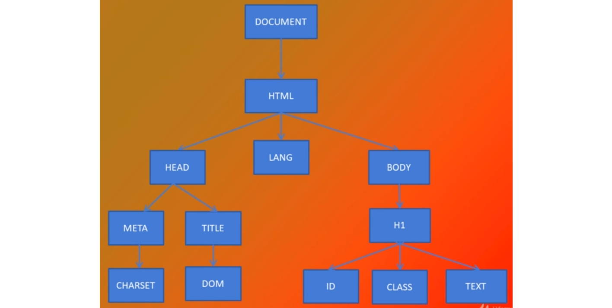

# DOM: Document Object Model
* DOM significa básicamente el modelo de objetos del documento; y es toda la estructura HTML del documento
* No es JavaScript, es una API (Aplication Programing Interface) que se utiliza a través de JavaScript.
* Es fundamental conocerlo, debido a que el 99% de las veces que se utiliza JavaScript es para interactuar con el DOM.
* Es algo que viene integrado en el navegador y nosotros podemos utilizarlo a través de JavaScript.

Para el documento HTML siguiente:
~~~
<!DOCTYPE html>
<html lang="en">
    <head>
        <meta charset="UTF-8">
        <meta name="viewport" content="width=device-width, initial-scale=1.0">
        <title>DOM</title>
    </head>
    <body>
        <h1 id="title" class="title"> DOM - Document Object Model </h1>
    </body>
</html>
~~~
Tendríamos el siguiente **_Árbol DOM_**:

* Esta forma de Árbol es la forma más común de representar el DOM; o cómo lee JavaScript el DOM.
* En general, la forma de árbol se puede desglosar de cualquier sitio con HTML, y las ramas (jerarquías) variarán en función de la complejidad del mismo.
-----

### Nodos
* Cada parte del árbol del documento es un **Nodo**.
* Aunque DOM significe _"Modelo de Objetos del documento"_ (porque técnicamente, cada una de las etiquetas HTML son objetos), el término correcto para hablar
de cada pieza del árbol es Nodo.
* Hay varios tipos de nodo (12 en concreto), pero los más utilizados son:
    * **_Element Node_**: Tipo 1. Es cualquier etiqueta HTML.
    * **_Text Node_**: Tipo 3. El contenido de la etiqueta
    * **_Comment Node_**: Tipo 8. Cualquier comentario en HTML
